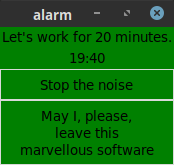

# alarm

## User case:
As a developer I needed a pomodoro timer, I didn't found any simply working for
free. Here is one now.

## Install:  

### Generic install:  

**Python 3.9** must be installed on your operating system. You can get it from
[The Python Foundation](https://www.python.org/).  
Consider installing and use a virtualenv.  
To install the needed libs, use:  
`python -m pip install -r requirements.txt`

## Usage:
You can use `alarm.py`. Alarm uses tkinter, a GUI is required.
This is not a CLI tool.  

## Known issue:
- On Windows, the color of the Button widgets don't change when over. This is
probably due to a tkinter internal bug I won't fix for now. I use it on linux
only. You are welcome if you aim to fix it.

## My own use:
I just installed the needed lib to my system python3 interpreter, I created a
shortcut to alarm on my favorite window manager. Thus, I just need to click on
it and enjoy.
